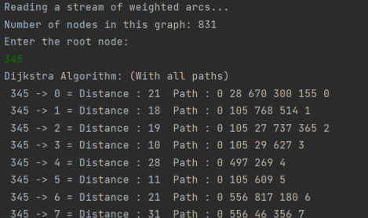

# Dijkstra Algorithm

### Description
Dijkstra pathfinding algorithm written in Java to find the shortest possible path between nodes in a weighted graph.

### Implementation
- First the code reads a graph of nodes.
- It prompts the user to choose the starting node.
- The code calculates all paths from the chosen node to all others.
- The paths are displayed along with the total distance and the route node by node until the final destination.

### Preview

### License
You are free to use this code.